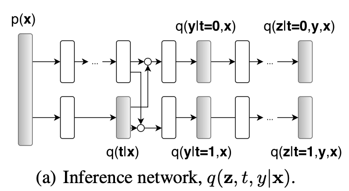
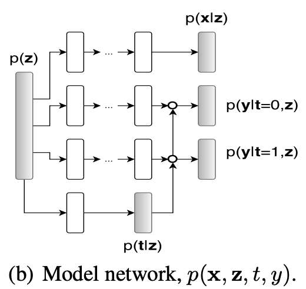
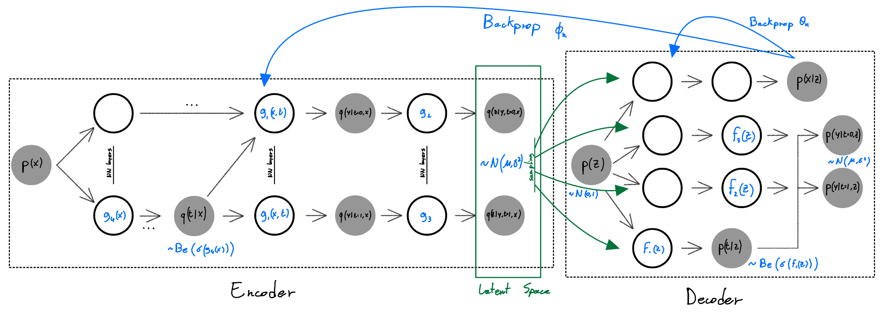

# CEVAE architecture in details

CEVAE is composed by two neural networks that work together in an encoder-decoder way:

### 1. Inference Network (Encoder)

This network learns to **infer hidder confounder Z** from the observed data. 

Inputs:

- Features **X**
- Treatment **t**
- Outcome **y**

Output:

A probability distribution over **Z** (in this case a Gaussian with learned mean and variance). 

**Key idea:** by observing **X,t,y** the architectyre can work in a backword way to reconstruct how **Z** looked like.

In this network, $p(z,t,y|x)$ is computed.

### 2. Model Network (Decoder)

This network represents our **causal understanding** of how the variables relate. It models:

- $p(X|Z)$ : how proxies depend on hidden confounders
- $p(t|Z)$ : how treatment assignment depends on confounders
- $p(y|t,Z)$ : how outcomes depend on treatment and confounders

## Training Process
CEVAE's training is sophisticated because it needs to handle a chicken-and-egg problem: we need to know Z to predict outcomes accurately, but we need to see outcomes to infer Z. Here VAE come to play. 

The core training objective is to maximize the ELBO:

$L = \sum_{i=1}^{N} \mathbb{E}_{q(z_i|x_i,t_i,y_i)}[\log p(x_i,t_i|z_i) + \log p(y_i|t_i,z_i) + \underbrace{\log p(z_i) - \log q(z_i|x_i,t_i,y_i)}_{-KL[q(Z|X,t,y)||p(Z)]}]$

This balances:

- How well we reconstruct **y** given our inferred **Z**
- How plausible our inferred **Z** values are
- The complexity of our inference network

Also, auxiliary networks are used for prediction. Since during training we know **t** and **y**, but not for new patients, two networks are trained:

- $q(t|X)$ : which predicts treatment from proxies alone
- $q(y|X,t)$ : which predicts outcomes from proxies and treatment

Thus the loss function to minimize becomes:
$\mathcal{F}_{CEVAE} = \underbrace{L}_{\text{ELBO}} + \sum_{i=1}^N (\underbrace{\log q(t_i=t_i^*|x_i^*)}_{\text{Treatment Pred. Loss}} + \underbrace{\log q(y_i=y_i^*|x_i^*,t_i^*)}_{\text{Outcome Pred. Loss}})$

Training step for patient i with observed (x_i, t_i, y_i):

1. Inference Network runs:
   - Input: **(x_i, t_i, y_i)**
   - Output: parameters of $q(z|x_i, t_i, y_i) - \text{say mean } \mu \text{ and variance } \sigma^2$

2. Sample from the approximate posterior:
   - $z_{sample} \sim q(z|x_i, t_i, y_i)$ using the $\mu$ and $\sigma^2$ from step 1

3. Model Network evaluates the probability of observed data given this z:
   - Compute $p(x_i|z_{sample})$ - "How likely are these proxies given this z?"
   - Compute $p(t_i|z_{sample})$ - "How likely is this treatment given this z?"
   - Compute {p(y_i|t_i, z_{sample})} - "How likely is this outcome?"

4. Compute the regularization:
   - KL divergence between $q(z|x_i, t_i, y_i)$ and $p(z)$

5. Combine into the loss and backpropagate through BOTH networks
   - ELBO backprops $\phi_1, \phi_2, \phi_3$
   - Treatment Pred. Loss backprops $\phi_4$
   - Outcome Pred. Loss backprops $\theta_1, \theta_2, \theta_3$

**IMPORTANT**

During training the $p(z)$ is used just to regularize the ELBO. Also, during training we use the auxiliary distributions since we want to **train** them. 

## Prediction Process

For a new patient instead:

1. We need to integrate over unknown **t** and **y**:
   $q(z|x) = \sum_t \int_y q(z|x,t,y) q(y|x,t) q(t|x) \,dy$

2. We sample several **z** values from this distribution

3. For each **z**, we use the MODEL network to predict:
   - Outcome if treated: $p(y|t=1, z)$
   - Outcome if not treated: $p(y|t=0, z)$

4. The difference gives us the individual treatment effect