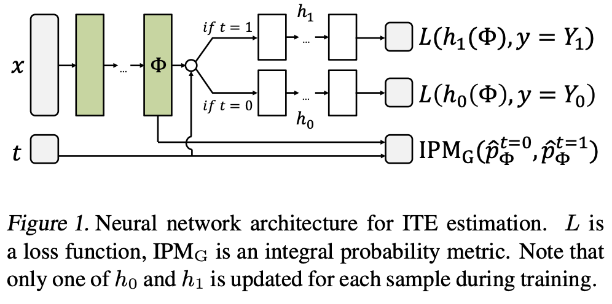

What is a **TARNet**?

Treatment-Agnostic Representation Network (TARNet) is the variant of the CFR model without balance regularization ($\alpha = 0$). It is trained by minimizing 

minimize over h,Φ: (1/N) * Σ(i=1 to n) w_i * L(h(Φ(x_i), t_i), y_i) + λ * R(h) + α * IPM_G({Φ(x_i) for i where t_i=0}, {Φ(x_i) for i where t_i=1})

with

$w_i = \frac{t_i}{2u} + \frac{1-t_i}{2(1-u)}$

where

$u = \frac{1}{n}\sum_{i=1}^{n}t_i$

and $\mathcal{R}$ is a model complexity term,

using stochastic gradient descent. Both the prediction loss and the penalty term $IPM_G(.,.)$ are computed for one mini-batch at a time. 

We assume there exists a distribution $p(x,t,Y_0,Y_1)$ over $X\times\{0,1\}\times Y \times Y$, such that strong ignorability holds. We further assume we have a sample from that distribution $(x_1,t_1,y_1), \dots, (x_n,t_n,y_n)$, where $y_i \sim p(Y_1|x_i)$ if $t_i = 1$, $y_i \sim p(Y_0|x_i)$ if $t_i = 0$. This standard assumption means that the treatment assignment determines which potential outcome we see. Our goal is to find a representation $\Phi : X \to \mathcal{R}$ and hypothesis $h : X \times \{0,1\} \to Y$ that will minimize $\epsilon_{PEHE}(f)$ (expected Precision in Estimation of Heterogeneous Effect (PEHE) loss) for $f(x,t) := h(\Phi(x),t)$.

We parameterize $\Phi(x)$ and $h(\Phi,t)$ by deep neural networks trained jointly, see Figure 1. This allows for learning complex non-linear representations and hypotheses with large flexibility. Here, if $\Phi$ is high-dimensional, the influence of $t$ on $h$ might be lost during training. To combat this, we parameterize $h_1(\Phi) = h(\Phi,1)$ and $h_0(\Phi) = h(\Phi, 0)$ as two separate "heads" of the joint network, the former used to estimate the outcome under treatment, and the latter under control. This way, statistical power is shared in representation layers, while the effect of treatment is preserved in the separate heads. Note that each sample is used to update only the head corresponding to the observed treatment. 

$IPM_G(.,.)$ is the (empirical) integral probability metric w.r.t. $G$. More details about the bound on the expected error in estimating the individual treatment effect are in [this paper](../References/shalit17a.pdf). The bound is expressed in terms of:

- The expected loss of the model when learning the observed outcomes $y$ as a function of $x$ and $t$, denoted $\epsilon_F$, $F$ standing for "Factual".
- The Integral Probability Metric (IPM) distance between the distribution of treated and control units.